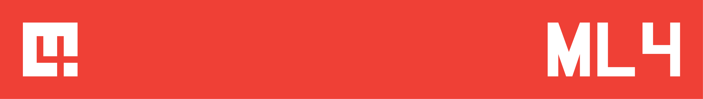
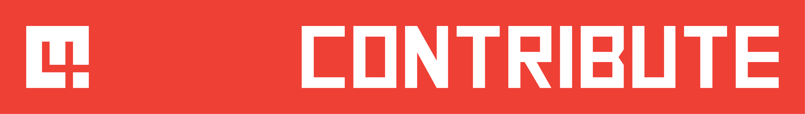
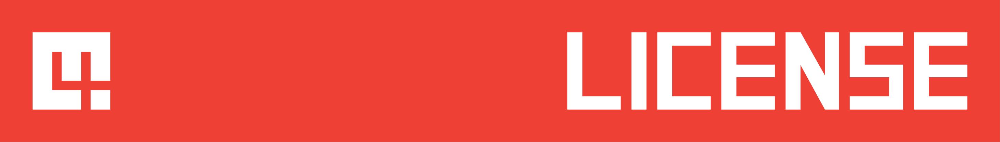

--- 
title: "ML4"
author: "Zach Bogart"
date: "`r Sys.Date()`"
site: bookdown::bookdown_site
documentclass: book
#bibliography: [book.bib]
#biblio-style: apalike
link-citations: yes
github-repo: "zachbogart/ML4"
url: 'https://zachbogart.com/ML4/'
description: "ML4 is for learning ML"
cover: "images/cover.png"
---

# Introduction {-}

## *ML4* is for learning ML

*ML4* is a collection of resources to help you learn about machine learning. It includes everything from textbooks on theory to links to cool demos. I made this so I could have my own go-to list of great ML resources. I hope you find it useful.

To put it simply, ***ML4* is for learning ML.**

## How this resource is organized
*ML4* is split into **three verbs** for learning about ML: **read**, **watch**, and **code**. Click on the banners below to explore each page.

{class="active-banner"}
{class="active-banner"}
{class="active-banner"}

## Help improve *ML4*
{class="active-banner"}

Not finding what you are looking for? Have a great resource I should add? Consider helping improve *ML4* by submitting a pull request to the [github page](https://github.com/zachbogart/ML4){target="_blank"}. Don't understand that last sentence? There's a [page on how you can contribute to *ML4*](contribute.html).

## Merch
{target="_blank" class="active-banner"}

Want to show off your love of *ML4*? *ML4* merch is available on [Teespring](https://teespring.com/stores/ml4){target="_blank"}. Hope you enjoy and thanks for supporting *ML4*.

<!-- Contact -->
## Contact
{target="_blank" class="active-banner"}

Zach Bogart: 
[Website](https://zachbogart.com/){target="_blank"}
/
[Twitter](https://twitter.com/zachbogart){target="_blank"}
/
[GitHub](https://github.com/zachbogart){target="_blank"}

<!-- License -->
## License
{target="_blank" class="active-banner"}

 This work is licensed under a <a rel="license" href="http://creativecommons.org/licenses/by-nc-nd/4.0/" target="_blank">Creative Commons Attribution-NonCommercial-NoDerivatives 4.0 International License</a>.

